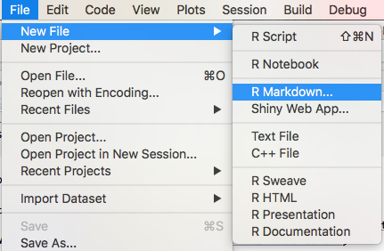
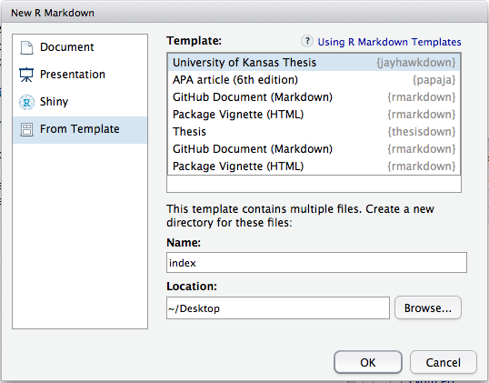
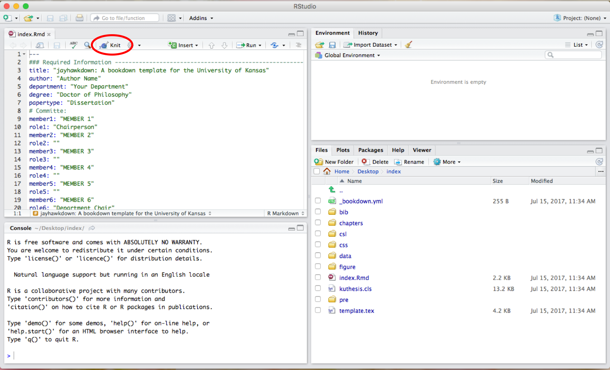

<!-- README.md is generated from README.Rmd. Please edit that file -->

# jayhawkdown 

<!-- badges: start -->

[](http://www.repostatus.org/#active)
[](https://travis-ci.org/wjakethompson/jayhawkdown)
[](https://ci.appveyor.com/project/wjakethompson/jayhawkdown)
[](https://codecov.io/gh/wjakethompson/jayhawkdown?branch=master)
[](https://cran.r-project.org/package=jayhawkdown)
<!-- badges: end -->

This package provides a template for writing theses and dissertations at
the University of Kansas using **rmarkdown** and **bookdown**. Much of
this was inspired by the
[**thesisdown**](https://github.com/ismayc/thesisdown) package by
Chester Ismay.

The original Latex template and class document were written by Paul
Johnson, and modified for use with pandoc and R markdown.

## Installation

You can install jayhawkdown from github with:

``` r
# install.packages("devtools")
devtools::install_github("wjakethompson/jayhawkdown")
```

You also need a working LaTeX program:

  - Macintosh: [MacTeX](https://tug.org/mactex/mactex-download.html)
  - Linux:
    [TeXLive](https://www.tug.org/texlive/acquire-netinstall.html)
  - Windows: [TeXLive](https://www.tug.org/texlive/windows.html)

## Example Usage

The recommended way to use this template is with RStudio; however, it is
possible to use this template with a different IDE.

### RStudio Usage

1.  Open a new RStudio window.

2.  Open a new R Markdown document.
    
    

3.  Select from templates, the University of Kansas Thesis template from
    the **jayhawkdown** package.
    
    

4.  Because there are multiple files for this template, you must create
    a directory to house them, and choose a location for the directory.
    I suggest calling this directory `index` (you can change this later,
    but this will make your main R Markdown document be called
    `index.rmd`).

5.  Select “OK”, and the template should open automatically. Press the
    “Knit” button at the top of the editor to render the template, and
    read the document for instructions on how to edit the template for
    your specific paper.
    
    

6.  If the PDF does not open automatically, you will be able to find it
    in the newly created `_book/` directory.

### Other Usage

If you are not using RStudio, you can create a new R Markdown from the
**jayhawkdown** template by using `rmarkdown::draft()`.

1.  Open R in your preferred IDE.

2.  Open the **jayhawkdown** template using `rmarkdown::draft()`. This
    will create a directory called `index/` (or whatever you name the R
    Markdown document) in your current working directory.
    
    ``` r
    rmarkdown::draft("index.rmd", template = "kansas", package = "jayhawkdown",
      create_dir = TRUE)
    ```

3.  When the template opens, you can render the document using
    `bookdown::render_book()`.
    
    ``` r
    setwd("index/")
    bookdown::render_book("index.rmd", "jayhawkdown::thesis_pdf")
    ```

4.  If the PDF does not open automatically, you will be able to find it
    in the newly created `_book/` directory.

### Troubleshooting

If the example PDF fails to render, try these steps:

  - If you are not using RStudio, attempt to render in RStudio.
  - Make sure your LaTeX environment was successfully setup.
  - Make sure your R packages are up to date, specifically
    **rmarkdown**, **bookdown**, **jayhawkdown**, and **knitr**.

If errors persist after trying all of these steps, post your process
along with the resulting error to a [new
issue](https://github.com/wjakethompson/jayhawkdown/issues) on Github,
and I will try to help.
