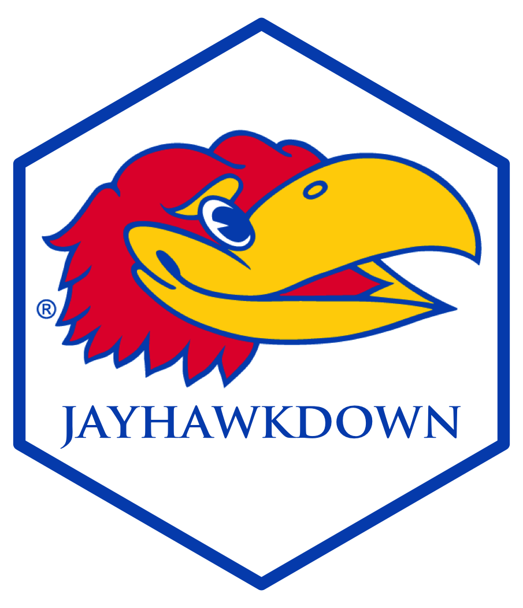

---
### Required Information -------------------------------------------------------
title: "Writing Theses and Dissertations with jayhawkdown"
author: "W. Jake Thompson"
credentials:
  - "B.S. Behavioral Neuroscience, University of Kansas, 2014"
  - "Ph.D. Educational Psychology, University of Kansas, 2018"
department: "Educational Psychology"
degree: "Doctor of Philosophy"
papertype: "Dissertation"
# Committe:
member1: "Committee Member #1"
role1: "Chairperson"
member2: "Committee Member #2"
role2: ""
member3: "Committee Member #3"
role3: ""
member4: "Committee Member #4"
role4: ""
member5: "Committee Member #5"
role5: "Outside member"
# If one date is supplied, both must be supplied
datedefended: "`r format(Sys.Date(), '%B %d, %Y')`"
dateapproved: "`r format(Sys.Date(), '%B %d, %Y')`"
### Rendering Options ----------------------------------------------------------
output: jayhawkdown::thesis_pdf
bibliography: ["bib/references.bib", "bib/packages.bib"]
biblio-style: apalike2
csl: csl/apa.csl
nocite: |
  @R-knitr, @R-rmarkdown, @R-bookdown, @R-jayhawkdown
link-citations: yes
lot: true
lof: true
### Website options ------------------------------------------------------------
description: >
  An example of how to use the jayhawkdown package to write dissertations and
  theses at the University of Kansas. This package allows users to write in
  R Markdown and have the output generate into a PDF that meets university
  guidelines.
url: https\://jayhawkdown.wjakethompson.com/
github-repo: wjakethompson/jayhawkdown
cover-image: "figures/jayhawkdown-large.png"
favicon: "figures/favicon.png"
### Pretext Sections -----------------------------------------------------------
abstract: >
  `r if (knitr::is_latex_output()) jayhawkdown::inc("pre/00-abstract.Rmd")`
acknowledgements: >
  `r if (knitr::is_latex_output()) jayhawkdown::inc("pre/00-acknowledge.Rmd")`
---

```{r setup, include = FALSE}
needed_packages <- c("dplyr", "forcats", "ggplot2", "purrr", "readr", "stringr",
  "tibble", "tidyr")
load_packages <- function(x) {
  if (!(x %in% rownames(installed.packages()))) {
    install.packages(x)
  }
  suppressPackageStartupMessages(require(x, character.only = TRUE))
}
vapply(needed_packages, load_packages, logical(1))

options(knitr.kable.NA = '')
```

`r if (knitr::is_latex_output()) '<!--'` 

# Welcome {-}

<a href="https://github.com/wjakethompson/jayhawkdown"></a>

This is the website for the **jayhawkdown** R package [@R-jayhawkdown]. The website is meant to provide documentation and example usage for creating a thesis or dissertation using the University of Kansas formatting. In addition to the website, this document is  also rendered as a PDF using the University of Kansas \LaTeX\ template. The PDF can be downloaded from

## License {-}

<a rel="license" href="https://opensource.org/licenses/GPL-3.0"></a>

This work, as a whole, is licensed under a <a rel="license" href="https://opensource.org/licenses/GPL-3.0">GNU General Public License, version 3</a>.

# Abstract {-}

`r jayhawkdown::inc("pre/00-abstract.Rmd")`

# Acknowledgements {-}

`r jayhawkdown::inc("pre/00-acknowledge.Rmd")`

`r if (knitr::is_latex_output()) '-->'`
